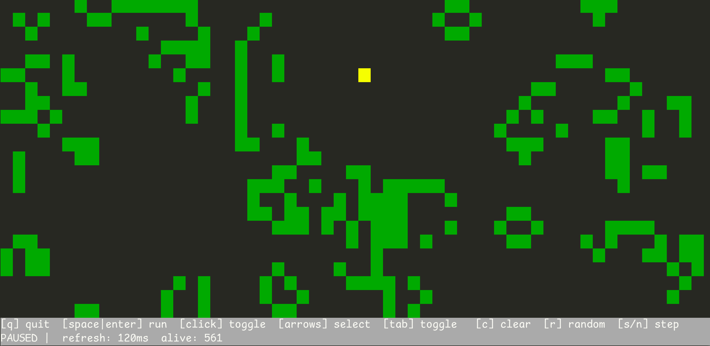

# funterm

Command line fun things to run in the terminal

## Install (macOS homebrew)

```
brew install sdball/tap/funterm
```

## Install (other)

[Binaries](https://github.com/sdball/funterm/releases) are available for Linux, Windows, and MacOS.

## Fun Things

### Game of Life

Game of Life in the terminal with an infinite grid, step control, speed controls, and adding/removing cells with keyboard or mouse.

Screenshot



Animated demo, thanks [VHS](https://github.com/charmbracelet/vhs)!


